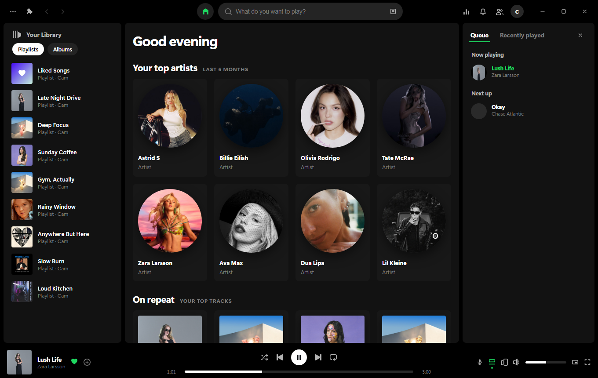
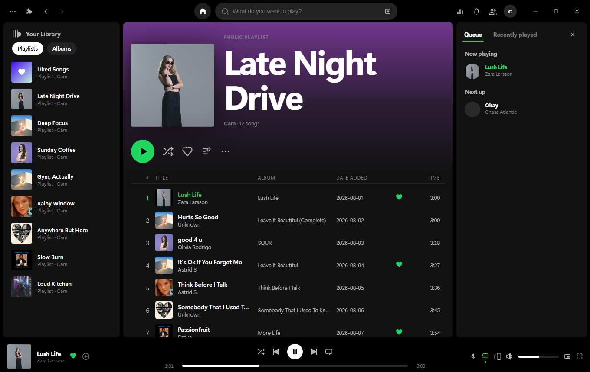
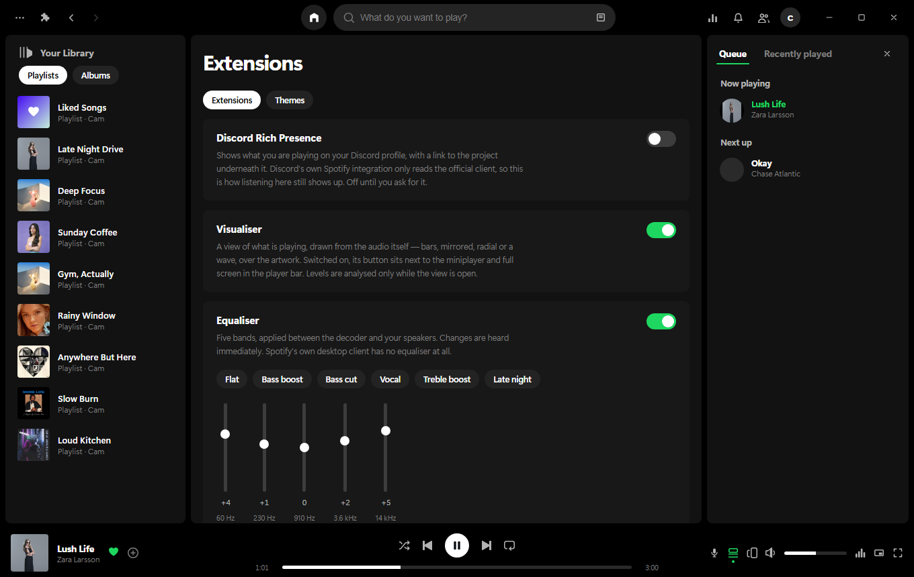
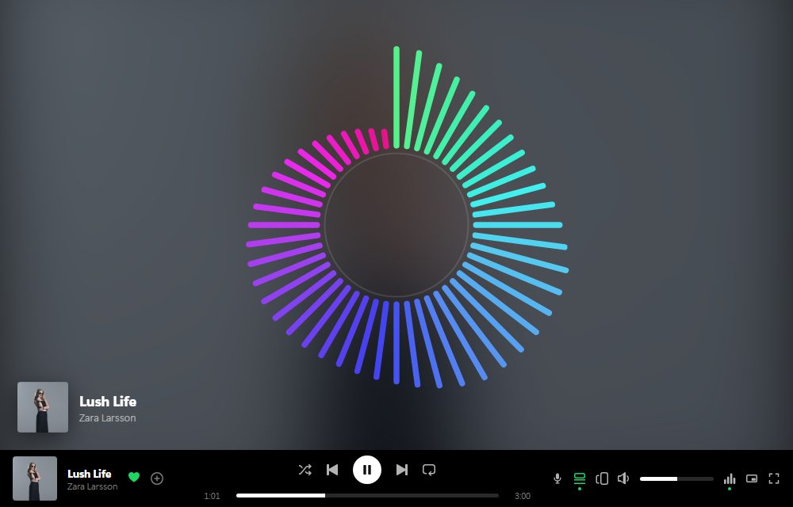
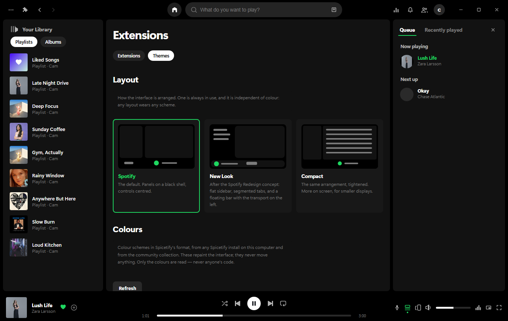
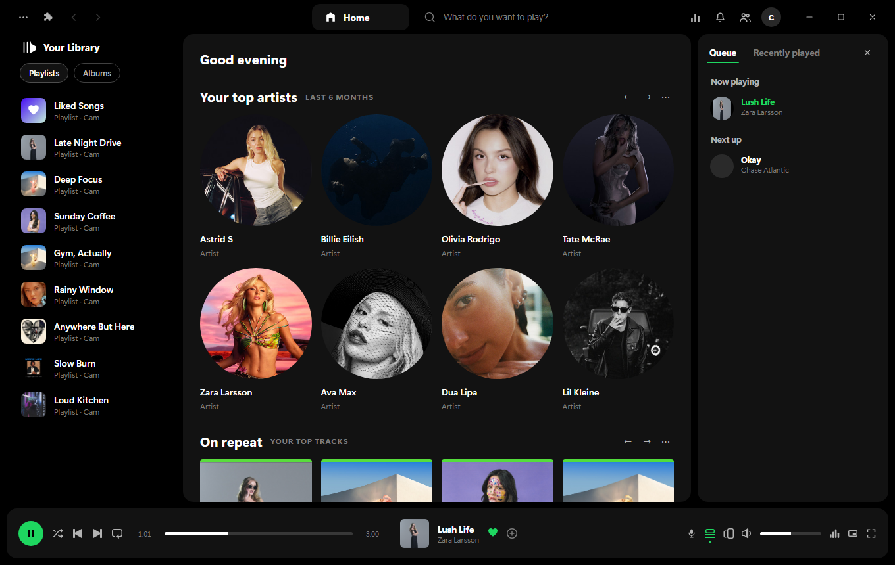
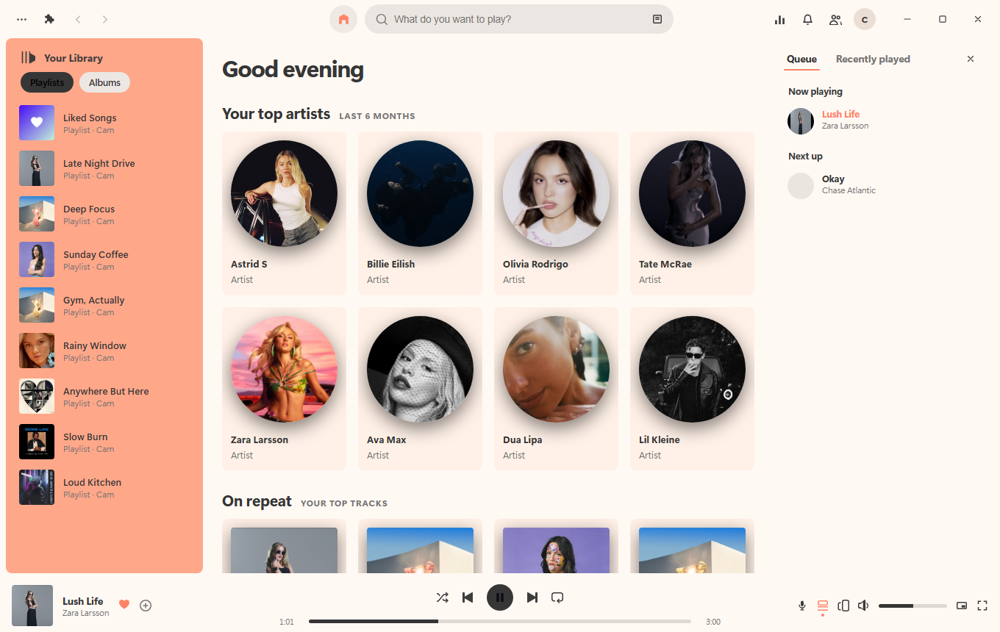
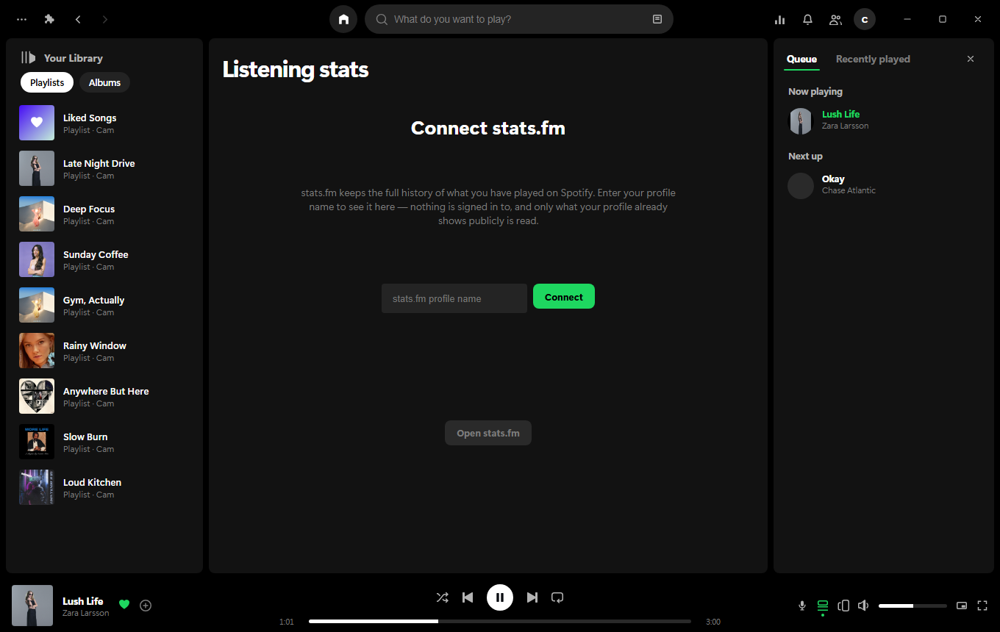
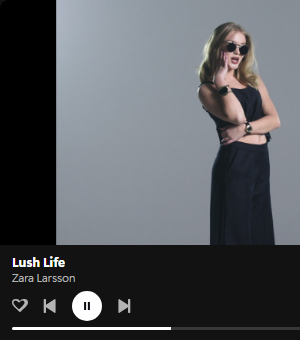

<div align="center">


# Rustify

**A Spotify player in Rust, where the music doesn't live in the window.**

[](https://github.com/camwooloo/Rustify/releases/latest)
[](https://github.com/camwooloo/Rustify/releases)




</div>

---

## The idea

The window and the player are **two separate processes**.

```
┌────────────────────────────┐
│  rustify                   │   the window: Tauri + WebView
│  no state of its own       │   close it whenever you like
└─────────────┬──────────────┘
              │  newline-delimited JSON over 127.0.0.1:4381
┌─────────────▼──────────────┐
│  rustifyd                  │   the player: librespot
│  ~15 MB, no GPU context    │   a Spotify Connect device
│  keeps playing regardless  │   Web API · lyrics · Jam
└────────────────────────────┘
```

Close the window before you launch a game. The music keeps going from a
process that has never created a GPU context, never composited a frame and
never loaded a browser engine. Reopen it whenever — it reconnects to whatever
was already playing.

That is the whole reason this exists. Everything else is built on top of it.

## Download

Three downloads per release, one per platform.

| Platform | File | Notes |
|---|---|---|
| **Windows** | `Rustify_x.y.z_x64-setup.exe` | Installs per-user, so no admin prompt. Updates itself silently. |
| **macOS** | `Rustify_x.y.z_aarch64.dmg` | Apple Silicon. Unsigned — first open needs right-click → **Open**. |
| **Linux** | `Rustify_x.y.z_amd64.AppImage` | `chmod +x` and run. |

**[→ Latest release](https://github.com/camwooloo/Rustify/releases/latest)**

> **Spotify Premium is required.** librespot cannot stream on a free account —
> this is a limit of Spotify's protocol, not a missing feature.

---

## What's in it

### Spotify, as you expect it

Your library, playlists, albums, artists, Liked Songs, search with filters,
a queue, recently played, and time-synced lyrics. Playback runs through
librespot, so Rustify appears as a normal **Spotify Connect** device — start
something on your phone and pick it up here, or the other way round.

The device list goes further than the Web API's, which only knows about
devices already signed in. Rustify listens for speakers advertising
themselves on the network, so idle ones show up too, and picking a speaker
that is not signed in signs it in and starts it playing — the same handshake
the official client performs.



Playlists are editable: rename, describe, delete, add and remove tracks, and
**drag rows to reorder** them.

### Extensions

Parts of Rustify you switch on and off. Everything here was written for this
app — nothing is fetched from a stranger's repository and run next to your
account.



- **Discord Rich Presence** — shows what you're playing, with a link to the
  project underneath. Discord's own Spotify integration only reads the
  official client, so without this, listening here shows nothing. Off by
  default.
- **Equaliser** — five bands, applied between the decoder and your speakers,
  heard immediately. Spotify's own desktop client doesn't have one at all.
- **Visualiser** — drawn from the audio itself, not faked from the beat.

### Visualiser



Bars, mirrored, radial or a wave; theme, spectrum or mono colour; over the
artwork, a solid ground or a glow. It sits beside the miniplayer and full
screen in the player bar.

The levels are real: the daemon runs an FFT at the same point the equaliser
sits — the one place every decoded sample passes through — and sends bands to
the window about thirty times a second. Nothing is analysed unless a
visualiser is open, and the request expires, so a window that dies does not
leave an FFT running.

### Themes

Two independent axes: a **layout** rearranges, a **colour scheme** repaints.
Any layout wears any scheme.



**Seven layouts** ship with the app:

| | |
|---|---|
| **Spotify** | The default. Panels on a black shell, controls centred. |
| **New Look** | After the [Spotify Redesign concept](https://www.figma.com/community/file/1376999463181735262/spotify-redesign) — flat sidebar, segmented tabs, capped cards, transport on the left. |
| **Compact** | The same arrangement, tightened. More on screen. |
| **Aurora** | Rustify's first look: translucent panels over an ambient wash. |
| **Focus** | The queue steps out and the artwork takes the room. |
| **Classic** | Flush and square, before everything floated. |
| **Mirror** | Handed the other way: library right, queue left. |



**Colour schemes** are in [Spicetify's](https://github.com/spicetify/spicetify-themes)
format — read from any Spicetify install on your machine and from the
community collection. Only the colours are read; never anyone's code.



A scheme names about ten colours and the interface needs thirty, so the rest
are derived by moving a named surface towards that theme's own text colour —
which is why light schemes look deliberate rather than washed out.

### Listening stats

Connect a [stats.fm](https://stats.fm) profile and see hours, top tracks,
artists and albums over four weeks, six months or all time. Every row plays:
a track starts, an artist or album opens its page here.



### Miniplayer and full screen

<div align="center">

</div>

A small window that stays above everything else, wearing whatever theme you
have on, and a full-screen view that fills the window with the artwork.

### The rest

- **Jam** — Spotify's shared listening sessions, hosting and joining
- **Windows integration** — media keys, the system Now Playing panel, taskbar
  thumbnail buttons, tray
- **Silent updates** on Windows: one click, a progress bar, and Rustify
  reopens on the new version
- **Offline-friendly**: the theme catalogue and audio cache both work without
  a network once fetched

---

## Building it

```bash
cargo build --release
```

Then the window, which bundles the daemon beside it:

```bash
cd app/src-tauri && cargo tauri build
```

Requirements: a stable Rust toolchain, and on Linux `libwebkit2gtk-4.1-dev`,
`libasound2-dev`, `librsvg2-dev` and `patchelf`. Releases are built by
[CI](.github/workflows/release.yml) on a runner per platform.

Running the pieces separately during development:

```bash
./target/release/rustifyd
```

```bash
./target/release/rustify
```

The window starts the daemon itself if it isn't already up, so you only need
both commands when you want the daemon's log in front of you.

> If you fork this, replace the Discord application id in
> `crates/daemon/src/presence.rs` with your own — the placeholder there
> connects to nothing.

---

## Where the walls are

Not shortcuts. Limits imposed from outside, listed so you know which is which.

**Spotify removed these Web API endpoints**, and nothing in this codebase can
bring them back:

- Artist **top tracks** — artist pages show discography only
- Recommendations, "Made For You", related artists
- Audio features and analysis, 30-second previews

Radio still works, but through a private endpoint rather than the documented
one.

**Private APIs.** Jam, lyrics and radio are reverse-engineered from official
clients. They parse permissively, so a schema change degrades to missing data
rather than a crash — and when one breaks, `crates/jam` is the place to look.

**Play next** is not implemented. The public API can only append to the queue,
and the private `set_queue` command that official clients use is refused for
this device. The attempt is preserved on the `play-next-spike` branch.

**Friend activity** is not implemented. The buddylist endpoint rejects every
credential this app can obtain; it only accepts a token minted from a browser
session cookie.

**Amazon speakers cannot be woken.** Echos are found and listed, but they
answer the sign-in handshake with an HTTP 500 whatever it contains — every
documented shape, payload and token was tried, and the timing says they never
get as far as asking Spotify. Start one from Alexa or the official app and it
joins the list like any other device. Speakers running librespot, spotifyd or
go-librespot are woken properly, and there is a test that does it.

**Free accounts** cannot play. librespot exits on a non-Premium account.

**The binaries are unsigned.** Windows SmartScreen and macOS Gatekeeper will
both say so.

---

## Legal

Rustify is a personal project, not a Spotify product, and is not affiliated
with or endorsed by Spotify.

It plays through **librespot**, which implements Spotify's protocol by
reverse engineering — outside Spotify's Terms of Service — and it deliberately
resembles Spotify's interface. A Premium account is required, and the account
holder carries whatever risk that implies. Use it with that in mind.
